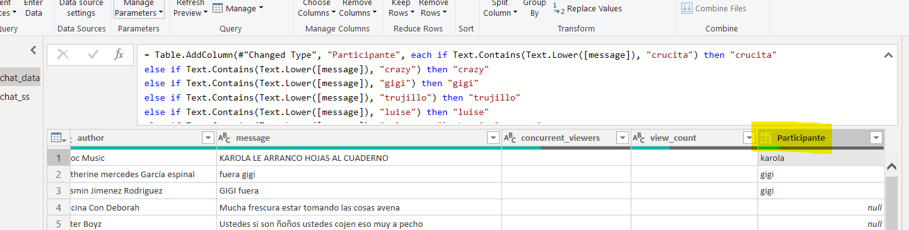
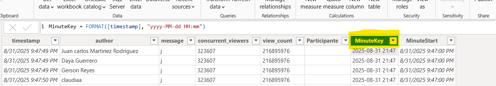
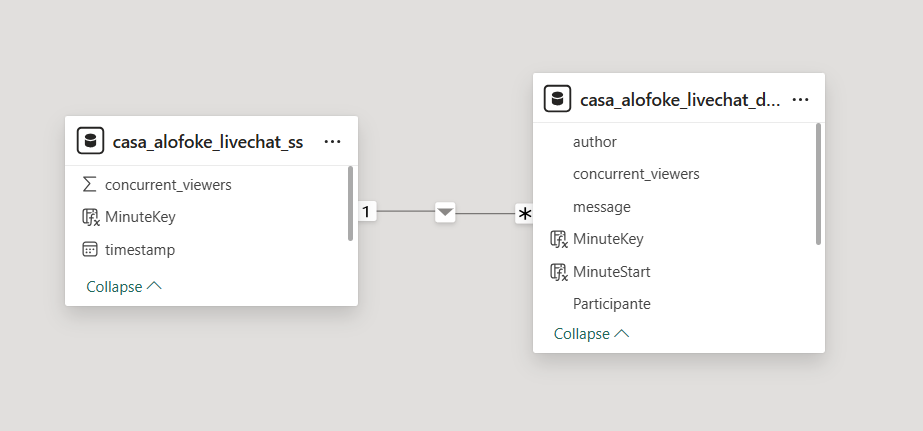
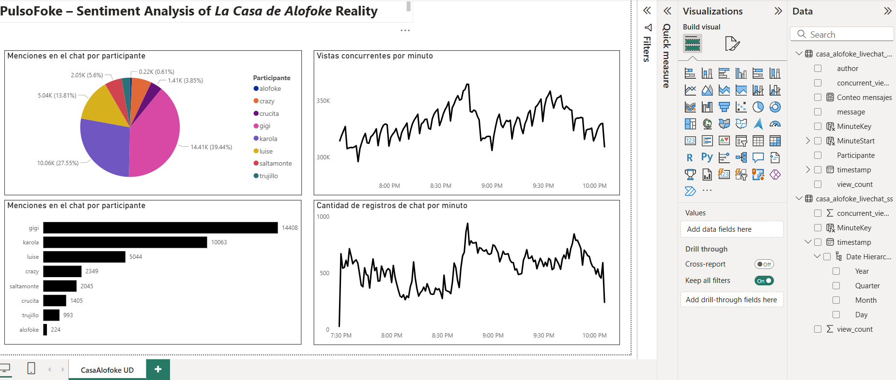

# Pulsofoke – YouTube Live Chat Analytics

**Libraries used:**

**Tech Stack**
- Python (pytchat, pandas, googleapiclient, os, time, datetime)
- Power BI (Power Query, DAX, Data Modeling)
- GitHub (Version Control, Portfolio Hosting)

**Project Overview**

This project analyzes the sentiment and engagement of the audience during the live reality show Casa Alofoke, one of the most popular reality shows in the Dominican Republic. Using live chat messages and YouTube API data, this report tracks audience sentiment, mentions of participants, and engagement patterns throughout the show.

The analysis is presented in an interactive Power BI dashboard, designed for portfolio purposes and hosted on GitHub.

This project demonstrates how to process unstructured data — text from live chat messages — and transform it into actionable insights.

**ETL Process**

**1. Extraction**

**1.1. Python (pytchat + YouTube API) was used to collect data:**

You can find the Python script used to extract the datasets [here](./lcextract.py).

For portfolio purposes, a static dataset covering a defined time range is included.

The API key used to extract live views is not included in the repository.

**1.2. View count and concurrent viewers were saved in the specified directory:** 

Live chat messages from the YouTube stream ([casa_alofoke_livechat_data.csv](./casa_alofoke_livechat_data.csv)). This dataset captures messages sent during prime time in the live chat, so it is very large.  
To view the complete dataset, click **"View raw"**

Concurrent viewers and total views every minute ([casa_alofoke_livechat_ss.csv](./casa_alofoke_livechat_ss.csv)).

**2. Transformation**

**2.1. Power Query was used for text cleaning and structuring unstructured data.**

A custom column named "Participante" was created to extract mentions of specific participants of the reality show from chat messages:

MinuteKey was created as a unique key for each minute, to be able to create relationships between datasets:

**2.2. A one-to-many relationship was established in Power BI, allowing interactive filtering between charts:**

`casa_alofoke_livechat_ss[MinuteKey] → casa_alofoke_livechat_data[MinuteKey]`

This relationship enables correlating viewer behavior with participant mentions.

**2.3. DAX measures were created to analyze:**

Messages per minute

Mentions per participant

Viewer count trends

**3. Load & Real-Time Analysis**

**3.1. Data loaded into Power BI for visualization.**

Thanks to the structure with MinuteKey, this setup can be applied to live streams for real-time analysis:

Monitor spikes in viewers as participants are mentioned.

Detect sentiment trends in real time.

Observe engagement patterns minute by minute.

**For the portfolio, static data is used, but the same structure allows real-time streaming analysis if connected to a live chat and the YouTube API.**

**Unstructured Data and Its Importance**

Unstructured data refers to information without a predefined format (e.g., chat messages, social media posts, emails).

Analyzing unstructured data allows companies to extract meaningful insights, detect trends, understand audience behavior, and improve decision-making.

This project shows how to structure and relate unstructured chat data to numeric metrics (views) for both static and real-time analysis.

**Potential Applications in Business**

This methodology is generalizable beyond reality shows:

Competitor Analysis (Retail) – Track mentions and sentiment of competitor products.

Trend Identification on Social Media (X, TikTok, Instagram) – Detect emerging topics and viral content.

Product Launch Sentiment (E-commerce) – Measure customer reactions during a launch.

Customer Feedback During Promotions (Retail) – Identify questions, complaints, and engagement in live events.

Marketing & Media Strategy – Evaluate the performance of campaigns, influencers, or ad content..

---
🚀 **This project was created as part of my data portfolio.**  
Feel free to explore the code, datasets, and dashboard. Feedback is welcome!
